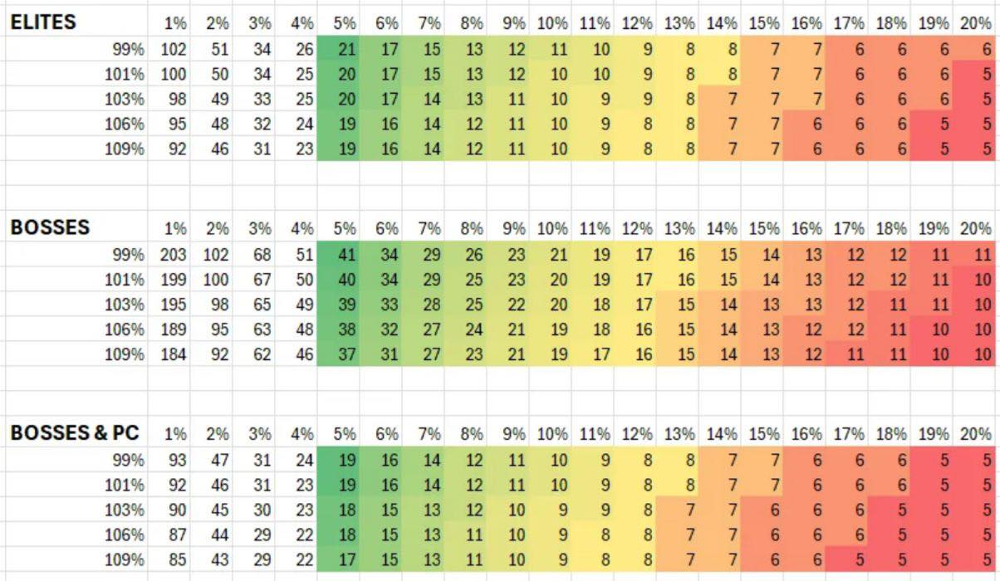

---
tags:
  - thorn
  - wall
  - boss
  - elite
---

# Thorn VS Boss/Elite

Horizontal data is the [wall thorn damage](https://the-tower-idle-tower-defense.fandom.com/wiki/Wall_Labs/Wall_Thorns) 
Vertical data is the [tower body thorn damage](https://the-tower-idle-tower-defense.fandom.com/wiki/Thorn_Damage) 
The corresponding number is the number of hit times to kill the boss/elite

PC is the [plasma cannon](https://the-tower-idle-tower-defense.fandom.com/wiki/Plasma_Canon),
directly causing damage to the BOSS

